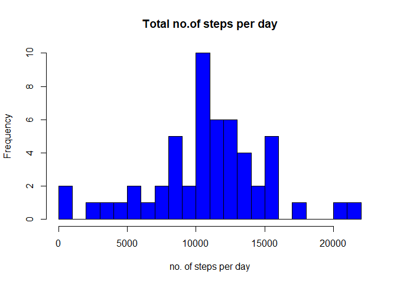
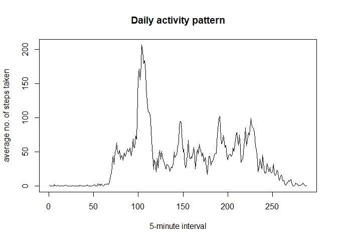
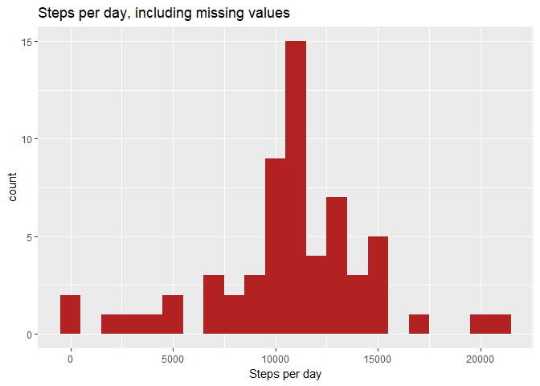
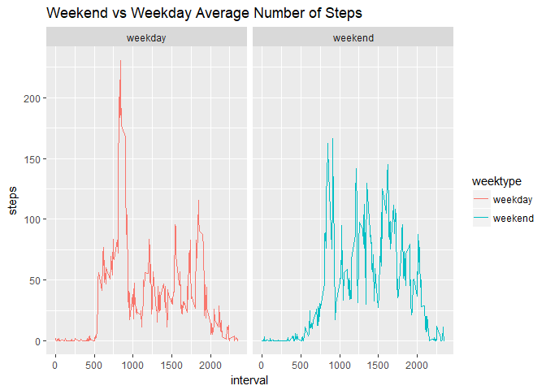

# Reproducible Research: Peer Assessment 1

```r
library(dplyr)
```

```
## 
## Attaching package: 'dplyr'
```

```
## The following objects are masked from 'package:stats':
## 
##     filter, lag
```

```
## The following objects are masked from 'package:base':
## 
##     intersect, setdiff, setequal, union
```

```r
library(datasets)
library(ggplot2)
library(knitr)
library(lubridate)
```

```
## 
## Attaching package: 'lubridate'
```

```
## The following object is masked from 'package:base':
## 
##     date
```

```r
opts_chunk$set(echo=TRUE)
```


## Loading and preprocessing the data

```r
setwd("c:/Users/drkeshwala/Desktop/coursera/RepData_peerAssessment1/activity")
activity_data <- read.table("activity.csv", header = TRUE, sep = ',')
activity_data$date <- ymd(activity_data$date)
activity_rm <- na.omit(activity_data)
```

## What is mean total number of steps taken per day?

```r
total_steps <- tapply(activity_rm$steps, activity_rm$date, sum)

# Histogram of total no. of steps per day
hist(total_steps,20, col = "blue", xlab = "no. of steps per day", main = "Total no.of steps per day")
```

<!-- -->

```r
mean_step <- mean(total_steps,na.rm = TRUE)
mean_step
```

```
## [1] 10766.19
```

```r
median_step <- median(total_steps, na.rm = TRUE)
median_step
```

```
## [1] 10765
```


## What is the average daily activity pattern?

```r
average_daily.activity <- tapply(activity_rm$steps, activity_rm$interval, mean)

# Plot of average daily activity pattern
plot(average_daily.activity, type = "l", xlab = "5-minute interval", ylab = "average no. of steps taken", main = "Daily activity pattern")
```

<!-- -->

```r
max_steps <- subset(average_daily.activity, average_daily.activity == max(average_daily.activity))
max_steps
```

```
##      835 
## 206.1698
```
*The interval 835 has a maximum no. of steps 0f 206.1698113

## Imputing missing values
# Total no of missing values in the datasets

```r
missing_values <- sum(is.na(activity_data))
missing_values
```

```
## [1] 2304
```
* Number of missing values : 2304

# fill the missing value with the mean of the 5-minute interval

```r
fill_data <- activity_data
nas <- is.na(fill_data$steps)
mean_interval <- tapply(fill_data$steps, fill_data$interval, mean, na.rm = TRUE)
fill_data$steps[nas] <- mean_interval[as.character(fill_data$interval[nas])]
```
 
# checking the missing values 

```r
sum(is.na(fill_data))
```

```
## [1] 0
```
* The new data set fill_data does not have any missing value.

# Histogram of the total no. of steps taken each day.

```r
data_steps <- fill_data %>% filter(!is.na(steps)) %>% group_by(date) %>% summarize(steps = sum(steps))

ggplot(data_steps, aes(x = steps)) + geom_histogram(fill = "firebrick", binwidth = 1000) + labs(title = "Steps per day, including missing values", x = "Steps per day")
```

<!-- -->

```r
mean_step1 <- mean(data_steps$steps,na.rm = TRUE)
mean_step1
```

```
## [1] 10766.19
```

```r
median_step1 <- median(data_steps$steps, na.rm = TRUE)
median_step1
```

```
## [1] 10766.19
```

*Comparing means and medians reveals that both means are the same while the new median including the missing value is slightly greater than the median without missing values.

## Are there differences in activity patterns between weekdays and weekends?

```r
fill_data$date <- as.Date(fill_data$date, "%Y-%m-%d")
fill_data <- mutate(fill_data, weektype = ifelse(weekdays(fill_data$date) == "Saturday" | weekdays(fill_data$date) == "Sunday", "weekend", "weekday"))

interval_data <- fill_data %>% group_by(interval, weektype) %>% summarise(steps = mean(steps))
```
# Histogram pattern  of activity patterns between weekdays ane weekends.

```r
ggplot(interval_data, aes(x=interval, y=steps, color = weektype)) + geom_line() +
        facet_wrap(~weektype, ncol = 2, nrow = 1) + ggtitle("Weekend vs Weekday Average Number of Steps")
```

<!-- -->
*From the two plots it seems, that the test object is more active earlier in the day during weekdays compared to weekends, but more active throughout the weekends compared with weekdays..
